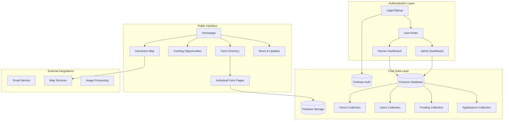
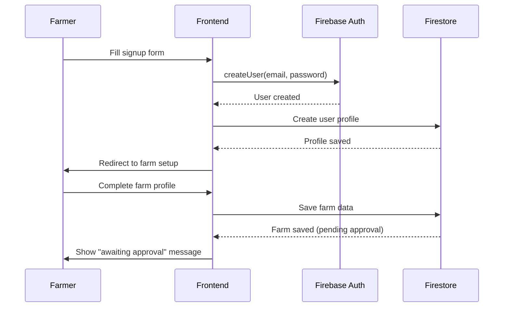
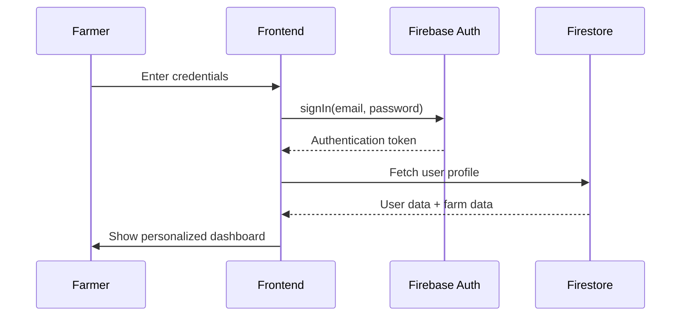

# Surrey Farming Cluster - System Architecture v2.0

## Architecture Overview



## Data Model

### Core Collections

#### Users Collection
```json
{
  "uid": "string",
  "email": "string",
  "displayName": "string", 
  "role": "farmer | admin",
  "createdAt": "timestamp",
  "lastLogin": "timestamp",
  "farmId": "string (optional)",
  "approved": "boolean",
  "profile": {
    "phone": "string",
    "address": "string",
    "bio": "string"
  }
}
```

#### Farms Collection
```json
{
  "id": "string",
  "ownerId": "string",
  "name": "string",
  "description": "string",
  "type": "string",
  "location": {
    "address": "string",
    "lat": "number",
    "lng": "number",
    "postcode": "string"
  },
  "products": ["string"],
  "images": ["string"],
  "contact": {
    "email": "string",
    "phone": "string", 
    "website": "string"
  },
  "sbiNumber": "string",
  "farmSize": "number",
  "establishedYear": "number",
  "certifications": ["string"],
  "isPublic": "boolean",
  "approved": "boolean",
  "createdAt": "timestamp",
  "updatedAt": "timestamp"
}
```

#### Funding Collection
```json
{
  "id": "string",
  "title": "string",
  "description": "string",
  "amount": "number",
  "deadline": "timestamp",
  "requirements": ["string"],
  "provider": "string",
  "category": "string",
  "status": "active | closed",
  "applications": "number"
}
```

## Authentication Flow

### Farmer Registration


### Login Flow


## Dashboard Architecture

### Farmer Dashboard Components
```
┌─────────────────────────────────────┐
│            Welcome Header           │
├─────────────────────────────────────┤
│  Farm Status | Profile Completion  │
├─────────────────┬───────────────────┤
│                 │                   │
│   Farm Profile  │   Quick Actions   │
│   Management    │   - Update Info   │
│                 │   - View Public   │
│                 │   - Connect       │
├─────────────────┼───────────────────┤
│                 │                   │
│ Funding Opps    │   Community       │
│ Relevant to Me  │   Latest News     │
│                 │                   │
└─────────────────┴───────────────────┘
```

### Admin Dashboard Components  
```
┌─────────────────────────────────────┐
│         Cluster Overview            │
├─────────────────────────────────────┤
│ Total Farms | New Apps | Funding $  │
├─────────────────┬───────────────────┤
│                 │                   │
│ Pending Reviews │   Content Mgmt    │
│ - Farm Apps     │   - Add Funding   │
│ - Profile Edits │   - News Posts    │
├─────────────────┼───────────────────┤
│                 │                   │
│ Recent Activity │   Analytics       │
│ - New Members   │   - Growth Chart  │
│ - Applications  │   - Engagement    │
└─────────────────┴───────────────────┘
```

## Technology Stack

### Frontend
- **React 19** with TypeScript
- **Tailwind CSS** for styling
- **React Router** for navigation
- **React Leaflet** for maps

### Backend Services
- **Firebase Authentication** for user management
- **Firestore** for real-time database
- **Firebase Storage** for images
- **Firebase Functions** for server logic

### Hosting & Deployment
- **Netlify** for static site hosting
- **GitHub** for version control
- **Continuous deployment** from main branch

## Security Considerations

### Data Protection
- All user data encrypted at rest
- HTTPS only communication
- Role-based access control
- Input validation and sanitization

### Authentication Security
- Strong password requirements
- Email verification required
- Session management with auto-logout
- Protected routes for sensitive areas

## Performance Optimization

### Frontend
- Code splitting by route
- Image optimization and lazy loading
- Caching strategies for static content
- Progressive Web App capabilities

### Backend  
- Firestore indexing for queries
- Pagination for large datasets
- Real-time listeners only where needed
- File upload size limits

## Monitoring & Analytics

### User Analytics
- Dashboard usage patterns
- Feature adoption rates
- User journey completion
- Drop-off points identification

### System Health
- Authentication success rates
- Database query performance
- Error tracking and alerting
- Uptime monitoring