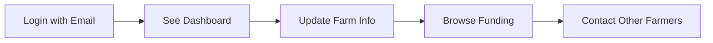

# Surrey Farming Cluster - Simplified MVP Plan

## Core Problem We're Solving

**Surrey farmers need an easy way to:**
1. **Connect** with other local farmers
2. **Access** government funding opportunities  
3. **Showcase** their farms to the community
4. **Collaborate** on resources and knowledge

## MVP User Stories

### 🌾 **For Farmers**

#### Essential Features
- [ ] **Join the cluster** with simple email signup
- [ ] **Create farm profile** that appears on public website
- [ ] **Browse other farms** in Surrey to find collaboration opportunities
- [ ] **Access funding database** with clear application guidance
- [ ] **Update farm information** easily through dashboard

#### Success Criteria
- Farmer can complete signup → profile creation → public listing in under 10 minutes
- Profile appears on main website immediately after creation
- Farmer can find and contact other local farms
- Funding opportunities are relevant and actionable

### 👨‍💼 **For Administrators**

#### Essential Features
- [ ] **Manage member applications** and profile reviews
- [ ] **Add funding opportunities** with clear details
- [ ] **Monitor cluster growth** through simple analytics
- [ ] **Moderate content** and ensure quality

#### Success Criteria
- Can approve new members in under 2 minutes
- Adding funding opportunities takes under 5 minutes
- Clear visibility into cluster health and growth

### 🌍 **For Public**

#### Essential Features
- [ ] **Discover local farms** through searchable directory
- [ ] **Learn about sustainable farming** in Surrey
- [ ] **Support local agriculture** by finding farm products
- [ ] **Understand cluster impact** through success stories

## Simplified Technical Implementation

### Phase 1: Foundation (Week 1)
```
┌─────────────────────────────────────┐
│        Simple Landing Page         │
│   "Join Surrey Farming Cluster"    │
├─────────────────────────────────────┤
│          Email Signup Form         │
│     (No complex authentication)    │
├─────────────────────────────────────┤
│       Static Farm Directory        │
│      (Show existing farms)         │
└─────────────────────────────────────┘
```

### Phase 2: Core Functionality (Week 2)
```
┌─────────────────────────────────────┐
│         User Dashboard              │
│    "Create Your Farm Profile"      │
├─────────────────────────────────────┤
│        Simple Profile Form         │
│   Name | Location | Products       │
├─────────────────────────────────────┤
│        Public Farm Listing         │
│     (Auto-publish after save)      │
└─────────────────────────────────────┘
```

### Phase 3: Value Addition (Week 3)
```
┌─────────────────────────────────────┐
│        Funding Database             │
│    "Find Grants for Your Farm"     │
├─────────────────────────────────────┤
│        Farmer Connection           │
│   "Contact Other Local Farms"      │
├─────────────────────────────────────┤
│         Admin Interface            │
│      "Manage the Community"        │
└─────────────────────────────────────┘
```

## Minimal Data Model

### Users (Keep it Simple)
```json
{
  "email": "farmer@example.com",
  "name": "John Smith", 
  "role": "farmer",
  "joined": "2024-01-15",
  "approved": true
}
```

### Farms (Essential Only)
```json
{
  "farmName": "Green Valley Farm",
  "ownerEmail": "farmer@example.com",
  "location": "Guildford, Surrey",
  "type": "Organic Vegetables",
  "products": ["Lettuce", "Tomatoes", "Herbs"],
  "contact": "01483 123456",
  "description": "Family-run organic farm since 1995",
  "public": true
}
```

### Funding (Simple Structure)
```json
{
  "title": "DEFRA Environmental Scheme",
  "amount": "£5,000 - £50,000",
  "deadline": "2024-03-31",
  "description": "Support for sustainable farming practices",
  "link": "https://gov.uk/funding-scheme",
  "relevant": ["Organic", "Environmental"]
}
```

## User Experience Flow

### New Farmer Journey (10 minutes total)


### Returning Farmer Journey (2 minutes)


## Success Metrics (Simple)

### Growth Metrics
- **New farmer signups per week**
- **Farm profiles completed**
- **Public directory views**

### Engagement Metrics  
- **Dashboard logins per week**
- **Profile updates**
- **Farmer-to-farmer contacts made**

### Value Metrics
- **Funding applications submitted**
- **Successful funding received**
- **Farmer collaborations formed**

## Implementation Priority

### Must Have (Week 1)
1. Landing page with clear value proposition
2. Simple email signup (no complex passwords)
3. Basic farm profile creation form
4. Public farm directory display

### Should Have (Week 2)  
1. Email login system
2. Profile editing capability
3. Funding opportunities database
4. Basic search and filtering

### Could Have (Week 3)
1. Admin dashboard
2. User approval workflow
3. Farmer messaging system
4. Simple analytics

### Won't Have (For Now)
1. Complex authentication
2. Image upload system
3. Real-time notifications
4. Mobile app

## Technical Constraints

### Keep It Simple
- Use existing tools and services
- Minimize custom development
- Focus on core user value
- Avoid over-engineering

### Technology Choices
- **Frontend**: Static HTML/CSS with minimal JavaScript
- **Backend**: Simple form handlers (Netlify Forms)
- **Database**: Airtable or Google Sheets for MVP
- **Authentication**: Email-only to start

This approach gets us to a working product that delivers real value in weeks, not months.